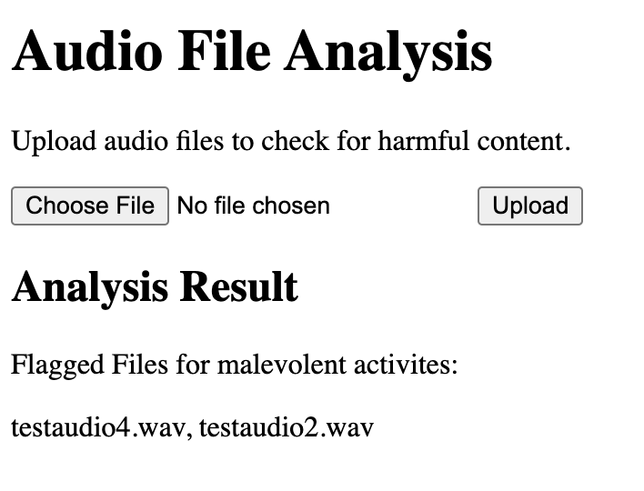

# audio-surveillance
An audio surveillance tool to flag malevolent activities.

The user uploads a folder containing several audio files containing conversations/dialogue. The application then flags certain audio files that could contain malevolent activites regarding terrorism and crime.

The front end and UI was made using html and css and the backend uses Python with the Flask framework.

My code converts all audio files from speech to text using google' SpeechRecognition package and stores the text as text files. My code then uses the SBERT (Sentence Bidirectional Encoder Representations from Transformers) that encodes the text files as numpy vectors (closer two vectors are to eachother, the more "similar" they are semantically) and stores these values as pickle files. I then use Facebook's FAISS (Facebook AI Similarity Search) to conduct a semantic search through my vectors to detect similarities between keywords (eg. bomb threats, murder, etc.) and the text. If the similarity metric is below a certain threshold, the corrosponding audio files are flagged for potential malevolent activites.

In order to run the application, make sure that your current working directory is audio-surveillance-flask and then run "python app.py."

I tested my application with a sample of 5 audio files totalling a minute of content (it takes around a minute to run). Files 1, 3, 5 contain normal conversation while files 2 and 4 contains threats and dialogue related to terrorism. My application correctly flags the malevolent audios.

Example of the GUI and the application working:

